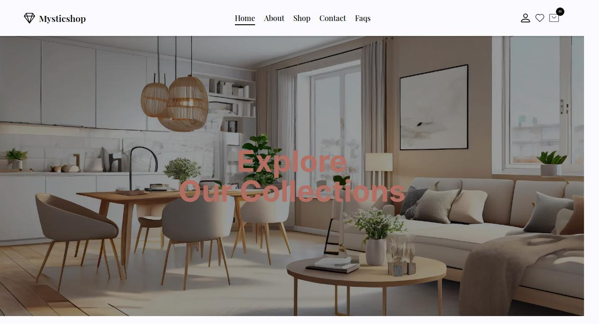

<a name="readme-top"></a>

<p align="center">
  <h1 align="center">
    Mystic Shop 
  </h1>
</p>

## Description

An online decor marketplace where users can discover and purchase a wide range of home decor items. The platform also empowers sellers to showcase and sell their unique products, fostering a diverse community of decor enthusiasts and creators.

## About The Project

### Preview



### Built With

* 	
* 	
* 	
*   
*   
*   

###   Getting Started

This is an example of how you may give instructions on setting up your project locally.
To get a local copy up and running follow these simple example steps.

### Installation

_Below is an example of how you can instruct your audience on installing and setting up your app. This template doesn't rely on any external dependencies or services._

1. Clone the repo
   ```sh
   git clone https://github.com/Qreamville/Tempest-Foods.git
   ```
2. Install NPM packages
   ```sh
   npm install
   ```
3. Enter your API in `.env file`
   ```TS
    NEXT_PUBLIC_SUPABASE_URL=YOUR API KEY
   ```
   ```TS
    NEXT_PUBLIC_SUPABASE_ANON_KEY=YOUR API KEY
   ```

<p align="right">(<a href="#readme-top">back to top</a>)</p>

